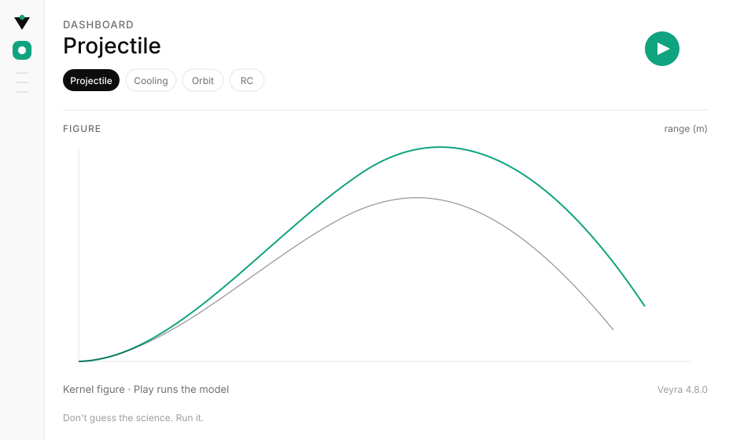

<p align="center">
  
</p>

<h1 align="center">Veyra Scientific</h1>

<p align="center"><strong>Don't guess the science. Run it.</strong></p>

<p align="center">
  <a href="LICENSE"></a>
  <a href="CHANGELOG.md"></a>
  <a href="CONTRIBUTING.md"></a>
  <a href="https://theworker02.github.io/veyra-scientific/"></a>
</p>

<p align="center">
  
</p>

Veyra is a **Cursor-native reproducible scientific computing environment**. Define a
version-controlled experiment, validate its schema and dimensions, execute it through the
local laboratory kernel, inspect its dependency graph, and retain the result, methods, and
environment evidence. The Agent does not invent numeric results; it reasons only over what the
kernel actually computed.

Not affiliated with OpenAI. The restraint is the point. Full FEA is out of scope.

## Install in Cursor

This is the product you submit to [Cursor Directory](https://cursor.directory/plugins/new) and the [Cursor Marketplace](https://cursor.com/marketplace/publish) once the GitHub repository exists. See [CONTRIBUTING.md](CONTRIBUTING.md).

1. Install the plugin (Directory, Marketplace, or link this folder to `%USERPROFILE%\.cursor\plugins\local\veyra-scientific`).
2. Reload. The `sessionStart` hook explains first run. The first MCP call and **Veyra: Doctor** run `hooks/bootstrap.py`, which installs the kernel and builds the Workbench VSIX before installing it when Cursor is available.
3. Ask the Agent to call **`start_laboratory`**, or Command Palette → **Veyra: Open Laboratory** (`Ctrl+Alt+V`) if the activity bar is present.

You do not pick a Python interpreter or create a venv from Cursor’s generic project wizard. Doctor and bootstrap own first run.

A Directory install without the extension still has a laboratory: MCP `start_laboratory` serves the Workbench at `http://127.0.0.1:8765/`.

| In Cursor | What it does |
|---|---|
| MCP `start_laboratory` | Starts the HTTP lab if it is down (no extension required) |
| Activity bar **Veyra** | Open Laboratory, Start laboratory, Doctor, Catalog, Run examples |
| **Veyra: Open Laboratory** | Starts the lab if it is down, then opens the Workbench |
| **Veyra: Doctor** | Installs kernel and Workbench extension from this folder |
| MCP `lab_status` | Agent checks whether the lab is running before guessing |
| **Veyra: New Experiment** (`Ctrl+Alt+E`) | Scaffold a `.veyra` file from the catalog |
| `/lab` `/run` `/verify` | Slash commands for the same kernel |

Workbench: `http://127.0.0.1:8765/` after **Open Laboratory** or `start_laboratory`.

### How to use the laboratory

1. Open Laboratory. Dashboard is the figure and the numbers the engine computed.
2. Catalog searches models. Instruments is math, Lens, units, measured CSV (path or paste), geometry, Fourier.
3. Notebook holds fingerprinted runs and a methods page you can keep.
4. Teal **Play** executes. `R` plays, `/` searches, `N` new run, `1`–`5` switch views, `T` theme.

## Plugin layout

Cursor Directory and the Marketplace discover these paths:

| Component | Path |
|---|---|
| Cursor manifest | `.cursor-plugin/plugin.json` |
| Agent Plugins manifest | `plugin.json` |
| Skills | `skills/*/SKILL.md` |
| Rules | `rules/*.mdc` |
| Agents | `agents/*.md` |
| Commands | `commands/*.md` |
| Hooks | `hooks/hooks.json` (`sessionStart` + after edit) |
| MCP | `mcp.json` → `scripts/veyra-mcp.py` |
| Logo | `assets/logo.svg` |
| License | [MIT](LICENSE) |

`python scripts/sync_plugin.py` copies skills, agents, commands, and the verification rule body into `.cursor/` for this workspace.

## Status

**v4.7.0** is a working laboratory and reproducible experiment runtime: RK4 drag trajectories, two-body orbits, Kepler periods, escape speed, free fall, SHM, Doppler, circular motion, nonlinear pendulum, damped oscillator, Bernoulli, 1D heat diffusion, RC / RL / LC circuits, thin lenses, Newton cooling, radioactive decay, Atwood, ballistic range tables, catalog sweeps, measured CSV overlay on the model source series, Lens diagnostics, live `.veyra` checks on save, graph-backed declarative experiments, deterministic cache records, and portable `.veyr` evidence artifacts. Full FEA remains future work and is not pretended here.

## Commands

```bash
python hooks/bootstrap.py --dev
veyra doctor
veyra serve examples
veyra test examples
veyra run examples/projectile.veyra
veyra validate examples/runtime-projectile.veyra
veyra graph examples/runtime-projectile.veyra
veyra catalog
veyra init projectile
veyra measure examples/data/cooling.csv --y-unit K --overlay cooling
veyra protocol <run-id> --html
```

## Scientific tests

```text
experiment projectile {
    model projectile
    inputs {
        velocity = 38.0 ± 0.3 m/s
        angle = 47 deg
        drag = 0.15
    }
    assert { velocity > 0 }
    simulate { trials = 64 }
}
```

`veyra test` is the suite. Every run is fingerprinted and can be reproduced or diffed.

## Declarative experiments and reproducibility

New `.veyra` files can use the stable, human-readable declarative format. Veyra validates the
schema, units, engine availability, and explicit solver tolerances before it calls an expensive
kernel. The original brace-format `.veyra` tests remain supported.

```yaml
name: projectile-runtime-reference
version: 1
parameters:
  velocity:
    value: 42
    unit: m/s
  angle:
    value: 38
    unit: deg
  gravity:
    value: 9.80665
    unit: m/s^2
simulation:
  engine: mechanics.projectile
  solver: analytic
monte_carlo:
  samples: 128
  seed: 182740195
outputs:
  - range
  - max_height
  - flight_time
assert:
  - expression: range > 0
```

`veyra graph` exposes the real dependency chain: initial conditions → validation → kernel
execution → selected outputs → assertions. Deterministic runs are cached under `.veyra/cache/`.
Each persisted result also has a structured `.veyra/results/<run-id>.veyr` artifact with its
experiment definition, graph, result, platform, runtime, seed, and reproducibility metadata.
See [declarative experiments](docs/experiments.md) for the supported schema and limitations.

## Design

See [DESIGN.md](DESIGN.md). Canvas `#ffffff`, ink `#0d0d0d`, slate `#6e6e6e`, hairline `#e5e5e5`, exclusive accent teal `#10a37f`. Inter, weights 400–600, no card stack, no extra hues.

Brand lives in `assets/`. One mark is copied to the Workbench, the activity bar, GitHub Pages, and this README with `python scripts/render_brand.py`.

## Support

If Veyra is useful to your work, you can support its continued development through [GitHub Sponsors](https://github.com/sponsors/theworker02) or [Thanks.dev](https://thanks.dev/u/gh/theworker02).

## License

[MIT](LICENSE). Copyright (c) 2026 theworker02.

Site: [theworker02.github.io/veyra-scientific](https://theworker02.github.io/veyra-scientific/). Changelog: [CHANGELOG.md](CHANGELOG.md).
