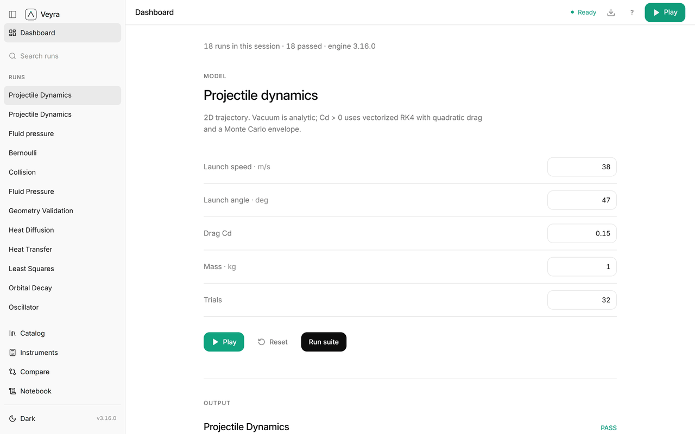

<p align="center">
  
</p>

<h1 align="center">Veyra Scientific</h1>

<p align="center"><strong>Don't guess the science. Run it.</strong></p>

<p align="center">
  <a href="https://github.com/theworker02/veyra-scientific/actions/workflows/ci.yml"></a>
  <a href="https://github.com/theworker02/veyra-scientific/releases"></a>
  <a href="LICENSE"></a>
  <a href="https://theworker02.github.io/veyra-scientific/"></a>
</p>



Veyra Scientific is a local-first computational laboratory for reproducible scientific work in Cursor. It combines a Python kernel, a declarative experiment format, an MCP server for agents, a VS Code/Cursor Workbench, and a command-line interface into one verifiable workflow.

Veyra is built for the point where an explanation needs to become evidence. Define a model, run it against explicit parameters, inspect the generated result, and record which checks passed or failed. The kernel produces numeric results; the interface and agent tools expose those results without inventing them.

## What Veyra provides

| Capability | What it does |
| --- | --- |
| Reproducible execution | Runs named scientific models with explicit inputs, units, solver settings, and output artifacts. |
| Declarative experiments | Uses portable `.veyra` YAML files for experiments, expectations, and tolerances. |
| Scientific verification | Compares computed values against constraints and reports structured pass/fail evidence. |
| Cursor-native workflows | Provides an MCP server, commands, status information, and an optional Workbench extension. |
| Local-first operation | Runs locally with no required account, telemetry service, or hosted data store. |
| Auditable outputs | Records run identifiers, model metadata, metrics, diagnostics, and verification results. |

## The Workbench

The Veyra Workbench is a quiet control room for the local kernel. Start it from Cursor with **Veyra: Open Laboratory** (`Ctrl+Alt+V`), or call `start_laboratory` through MCP. It serves locally at `http://127.0.0.1:8765/`.

The interface includes:

- **Dashboard** — recent runs, kernel status, model health, and verification activity.
- **Catalog** — available computational models and their supported parameters.
- **Instruments** — focused controls for configuring and running experiments.
- **Compare** — side-by-side result inspection and run-to-run deltas.
- **Notebook** — a traceable record of runs, notes, and exported evidence.

The GIF above is captured from the running local Workbench using the repository's capture script; it is not a mockup.

## Scientific runtime

Veyra separates model execution from presentation and automation:

```text
Cursor / CLI / MCP / Workbench
             │
             â–¼
        Veyra Python kernel
             │
     ┌───────┼────────┐
     â–¼       â–¼        â–¼
  models   solvers  verification
     │       │        │
     └───────┴────────┘
             │
             â–¼
     structured run evidence
```

The Python kernel is the authority for numeric output. MCP tools and the Workbench can present, save, compare, and verify results, but they do not substitute generated prose for a calculation.

### Included model families

The catalog currently includes computational models for:

- classical mechanics and orbital dynamics;
- oscillators, wave motion, and signal analysis;
- heat transfer and diffusion;
- fluid and transport approximations;
- electricity, circuits, and electromagnetism;
- optics and spectral calculations;
- probability, statistics, regression, and uncertainty analysis;
- geometry, numerical methods, and units-aware calculations.

Each model exposes typed parameters, validation rules, result metrics, and model-specific verification logic. The catalog is intentionally extensible: a model is an implementation plus a clear contract, not a loose prompt template.

## Experiments as files

`.veyra` files keep a run's inputs and assertions next to the code or data that motivated it. A minimal experiment looks like this:

```yaml
name: Damped oscillator baseline
model: damped_oscillator
parameters:
  mass: 1.0
  spring_constant: 12.0
  damping: 0.4
  initial_displacement: 0.1
  initial_velocity: 0.0
expect:
  - metric: final_displacement
    operator: abs_lt
    value: 0.02
```

Run an experiment with `veyra test`, inspect it in the Workbench, or ask an MCP client to run and verify it. Assertions are evaluated from the actual model output and include the observed value, expected condition, tolerance context, and diagnostic detail.

## Installation

### Requirements

- Python 3.10 or later
- Cursor or VS Code, for the optional Workbench extension and editor integration
- Node.js 20+ only when rebuilding the Workbench or extension from source

### Install from a checkout

```powershell
git clone https://github.com/theworker02/veyra-scientific.git
cd veyra-scientific
python -m pip install -e ".[dev]"
veyra doctor
```

On Windows, use the Python launcher if needed:

```powershell
py -3 -m pip install -e ".[dev]"
py -3 -m veyra doctor
```

`veyra doctor` checks the local installation and reports actionable diagnostics. It does not require a cloud account.

### Use Veyra without Cursor

Cursor is optional. Download the `veyra_scientific-<version>-py3-none-any.whl` asset from the [latest GitHub release](https://github.com/theworker02/veyra-scientific/releases/latest), then install it locally:

```powershell
python -m pip install .\veyra_scientific-<version>-py3-none-any.whl
veyra catalog
veyra serve examples --no-open
```

This installs the same Python kernel and command-line laboratory used by the Cursor integration. To use the optional activity-bar integration in VS Code or Cursor, download `veyra-workbench.vsix` from that release and choose **Extensions: Install from VSIX…**.

### Install in Cursor

Install from the [Veyra Scientific page on Cursor Directory](https://cursor.directory/plugins/veyra-scientific), or use a local checkout, directory distribution, or Marketplace when available.

The plugin bootstrap installs the kernel from this checkout on first use and packages the optional Workbench extension when an archive is not already present.

Once installed:

1. Open a workspace containing Veyra experiments or models.
2. Run **Veyra: Open Laboratory** (`Ctrl+Alt+V`) to start the local Workbench.
3. Use the Veyra MCP tools from an agent, or run experiments through the CLI.

## Command-line workflow

```powershell
# See installed models and their metadata
veyra catalog

# Create an experiment from a catalog model
veyra init damped_oscillator

# Run every declarative experiment under examples/
veyra test examples

# Start the local Workbench without opening a browser window
veyra serve examples --no-open
```

Use `veyra --help` and `veyra <command> --help` for the full command reference.

## MCP workflow

Veyra's MCP server lets Cursor agents use the same local kernel as the CLI and Workbench. Core tools include:

| Tool | Purpose |
| --- | --- |
| `lab_status` | Report kernel availability, active run state, and laboratory details. |
| `start_laboratory` | Start the local Workbench server. |
| `catalog_models` | List available models and their contracts. |
| `simulate_*` | Run supported simulations with validated input. |
| `analyze_measurement` | Analyze a provided measurement series or result. |
| `verify_model` | Evaluate a model result against explicit checks. |
| `agent_run_experiment` | Run an explicitly requested catalog experiment for a Cursor agent with bounded numeric inputs, assertions, and recorded provenance. |

### Agent-run experiments in Cursor

When a user asks Cursor to run a supported experiment, the **Veyra Experiment Runner** maps that request to a catalog model and calls `agent_run_experiment`. The tool requires the original request, validates parameter names and catalog bounds before computation, runs only the local Veyra kernel, and records the selected model, inputs, assertions, diagnostics, and run ID. It does not execute shell commands or write experiment files.

For example, an agent can run a projectile model with catalog-unit inputs and make the result evidence-bearing:

```text
agent_run_experiment(
  request="Simulate a 42 m/s projectile launched at 38 degrees and check that it travels farther than 100 m.",
  model="projectile",
  parameters={"velocity": 42, "angle_deg": 38, "drag_coefficient": 0.0},
  assertions=["mean_range > 100"]
)
```

Use `/agent-experiment` in Cursor to invoke that workflow. The agent must explain the model assumption and report failed checks rather than replace them with a guess.

Agents should describe results as computed evidence, cite failed checks plainly, and avoid extrapolating beyond the model's stated assumptions.

## Verification and scope

Veyra is designed to make ordinary computational work easier to reproduce and inspect. A passing verification means the recorded result met the specific checks in the experiment; it is not a universal claim that a scientific hypothesis is true.

Before relying on a result, review:

- the model's assumptions and parameter bounds;
- units, initial conditions, and numerical tolerances;
- diagnostics and failed assertions;
- whether the model family is appropriate for the physical system.

Full finite-element analysis, safety-critical certification, and high-consequence engineering sign-off are outside the current scope. Validate important work independently and use domain expertise where required.

## Development

```powershell
# Python test suite
python -m pytest -q

# Declarative scientific suite
python -m veyra test examples

# Verify generated plugin files are synchronized
python scripts/sync_plugin.py --check

# Rebuild the Workbench after changing its source
cd workbench
npm ci
npm run build
```

Run the documentation and media pipeline after updating brand assets or Workbench screenshots:

```powershell
python scripts/capture_workbench.py
python scripts/render_brand.py
```

`capture_workbench.py` requires a Workbench server on `127.0.0.1:8765`; `render_brand.py` distributes canonical marks and builds `docs/media/workbench.gif` from the captured frames.

## Project layout

```text
veyra-scientific/
├── veyra/                         Python kernel, models, solvers, and CLI
├── mcp_server/                    MCP integration and tool contracts
├── workbench/                     Local React Workbench
├── extensions/veyra-workbench/    Cursor/VS Code extension
├── hooks/                         Cursor plugin bootstrap and lifecycle hooks
├── examples/                      Declarative .veyra experiment suite
├── tests/                         Kernel, MCP, packaging, and regression tests
├── scripts/                       Release, capture, and asset synchronization tools
├── docs/                          GitHub Pages source and public media
└── assets/                        Canonical Veyra brand assets
```

## Documentation and support

- Project site: [theworker02.github.io/veyra-scientific](https://theworker02.github.io/veyra-scientific/)
- Contribution guide: [CONTRIBUTING.md](CONTRIBUTING.md)
- Security policy: [SECURITY.md](SECURITY.md)
- Changelog: [CHANGELOG.md](CHANGELOG.md)
- Support: [GitHub Sponsors](https://github.com/sponsors/theworker02) and [Thanks.dev](https://thanks.dev/u/gh/theworker02)

## Contributing

Contributions are welcome when they improve computational correctness, reproducibility, model documentation, test coverage, or the local developer experience. Please read [CONTRIBUTING.md](CONTRIBUTING.md) before opening an issue or pull request. Changes to scientific behavior should include a `.veyra` example or focused regression test whenever practical.

## License

**Source-available proprietary** — evaluation under [LICENSE](./LICENSE); commercial / production use via [COMMERCIAL.md](./COMMERCIAL.md). See [LICENSE_TRANSITION_NOTICE.md](./LICENSE_TRANSITION_NOTICE.md) and [NOTICE](./NOTICE).


---

## License & acquisition

This project is **proprietary**. Production use, redistribution, and commercial deployment require a written commercial license or completed acquisition. See [LICENSE](./LICENSE) and [ACQUISITION.md](./ACQUISITION.md). Contact [@theworker02](https://github.com/theworker02).
